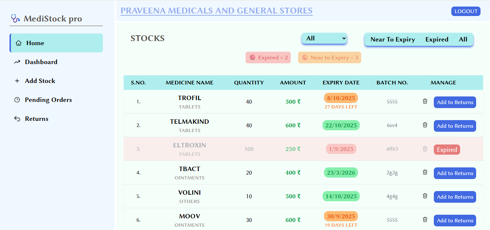
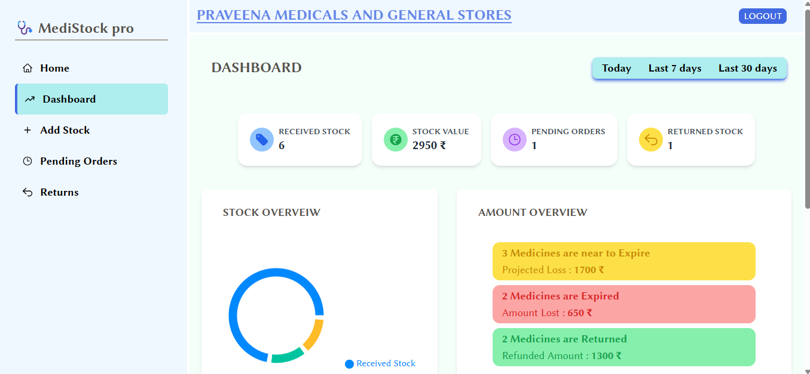
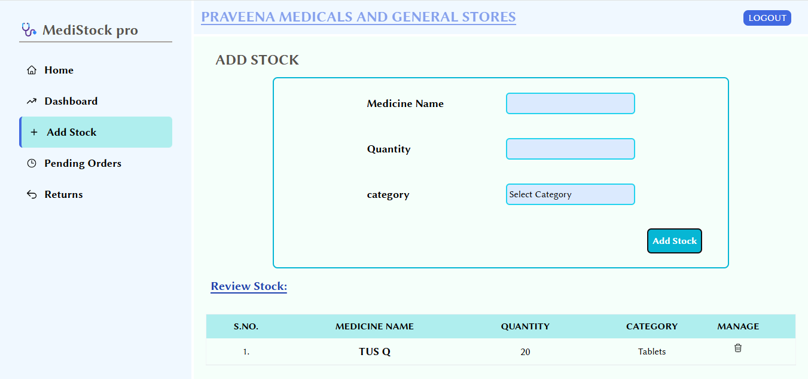
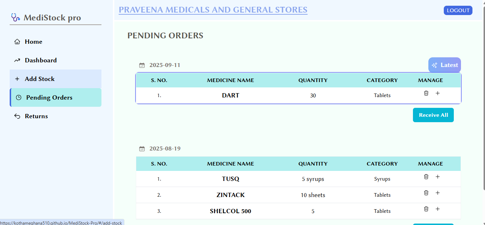
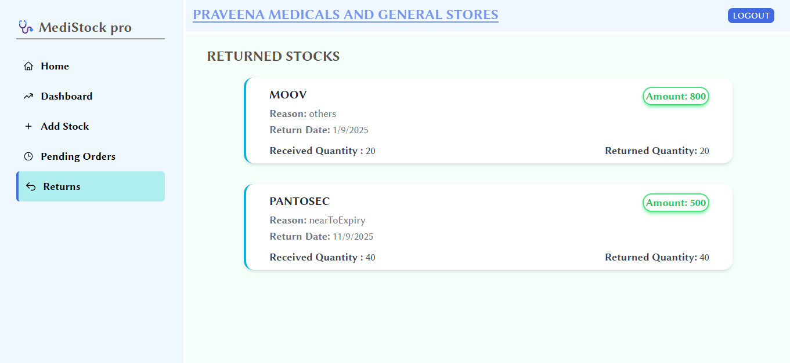

# MEDISTOCK PRO

A Web-based inventory managemnet system built as a personal project for Medical shops  to track Pending Orders, Received Stocks, Returnsand Stock Expiry. Designed for internal use, this project simplifies managing stocks and helps pervent wastage due to expired medicines.

## Features
- Add, review and manage pending orders
- Record received stocks
- Monitor returns and damaged stocks
- Alert for expired and near-to-expiry medicines with color coded indicators
- Dashboard displaying received, pending and returned stocks with insightful charts
- login using supabase authentication
- Toast notifications for important actions

## Technologies Used
- **React** - for building the user interface
- **Vite** - fast development build tool
- **React Query** - efficient data feching and state management
- **Supabase** - backend as a service [database, authenticatioon etc.]
- **Tailwind CSS** - styling framework for clean and responsive UI
- **REcharts** - Charts and Graphs for better data visualization

## Problem it Solves
Managing stock manually can lead to mistakes, expired medicines and financial loss. This projec helps solve those problems by: 

- Tracking received stocks, pending ordres and returns in one place.
- Alerting the shop owner when medicines are near expiry or already expired.
- Providing useful visual charts and stats to monitor stock at a glance.

It's designed to simplfy stock management and reduce wastage, helping medical shops operate smoothly.

## Screenshots

Here are some screenshots of the project in action

### Home Page View

### Dashboard View

### Add Stock view

### Pending Orders

### Returns Page
